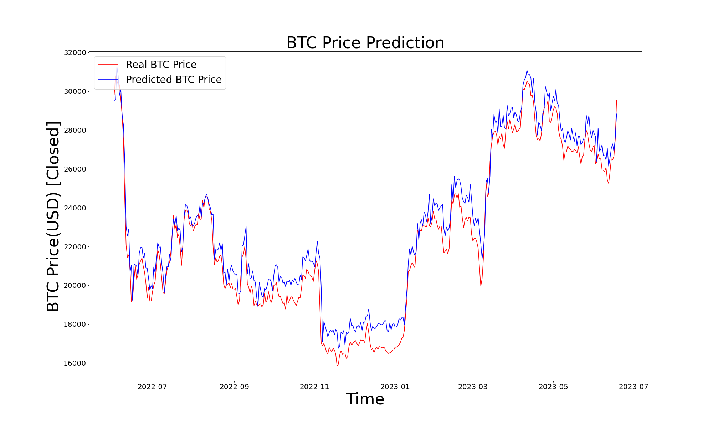

# Crypto Prediction Model (Orbit)

This project has been simplified to focus exclusively on training and saving the **Orbit** model for cryptocurrency price prediction. All unnecessary models, backtesting logic, and unused directories have been removed to keep the structure clean and straightforward.

## Performance & Results (Bitcoin)

We trained the Orbit model on **Bitcoin (BTC)** historical daily data from **2018-01-01** to **2022-06-01**, and validated its performance on unseen data from **2022-06-01** to **2023-06-25**.

### Evaluation Metrics

| Metric | Score | Description |
|---|---|---|
| **Accuracy** | `0.672` | The model correctly predicts the market direction ~67.2% of the time. |
| **F1 Score** | `0.675` | Harmonic mean of precision and recall, showing balanced classification. |
| **Precision** | `0.681` | When predicting an upward trend, it is correct 68.1% of the time. |
| **Recall** | `0.670` | Detects 67% of the actual positive trends. |
| **MAE** | `761.07` | Mean Absolute Error (average price deviation). |
| **RMSE** | `880.43` | Root Mean Squared Error. |
| **MAPE** | `3.62` | Mean Absolute Percentage Error (average 3.62% error off the true price). |
| **SMAPE** | `3.53` | Symmetric Mean Absolute Percentage Error. |

### Predictions Plot

Below is the graph plotting the model's performance on the validation dataset:



## Project Structure

- `data/`: Contains historical cryptocurrency price data (e.g., `XBTUSD-1d-data.csv` for Bitcoin).
- `data_loader/`: Logic for preprocessing and loading the datasets.
- `models/`: Contains the implementation of the `orbit` model.
- `factory/`: Core components for training and evaluating the model.
- `configs/`: Hydra configuration files for customizing the training process.
  - `configs/hydra/train.yaml`: Main configuration (dataset path, symbol, etc.).
  - `configs/hydra/dataset_loader/common.yaml`: Defines the date ranges for training and validation.
- `metrics/`: Utilities for calculating performance metrics (Accuracy, F1 Score, etc.).
- `utils/`: Helper scripts for logging and reporting metrics.
- `plots/`: Directory containing generated performance visualization graphs.
- `train.py`: The main entry point to train and save the model.
- `model.pkl`: The successfully trained model output artifact.

## How to Run

1. **Install dependencies:**
   Make sure your environment is set up. All required packages for the orbit model are in the requirements file.
   ```bash
   pip install -r requirements.txt
   ```

2. **Run the training script:**
   ```bash
   python train.py
   ```

When ran, the program will sample the data via CmdStanPy, evaluate on the validation data, print the final scores to the console, overwrite `model.pkl`, and output fresh graphs into the `plots/` folder.
